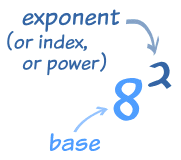

---
hide:
  - navigation
---


## Types of PI in Fusion Engine
These are used for certain miscellaneous math things.

Full version of pi (3.141592653589793238462643383279502884197):
```python
	main.math.PI
```
A slightly smaller version that python's math library uses (3.141592653589793):
```python
	main.math.SMALLERPI
```
An extremely shortened version of pi (3.14):
```python
	main.math.SMALLPI
```
## Other Math Components
This allows you to get the floor value of a number.
```python
main.math.FLOOR(3.4)
```
This allows you to use exponets in Fusion Engine.
<br>


Replace exponent and base to what you desire.
```python
	main.math.POWER(exponent, base)
```
## Euler's Number
You can read more about it [here.](https://en.wikipedia.org/wiki/E_(mathematical_constant))
```python
	main.math.EULERNUMBER
```
